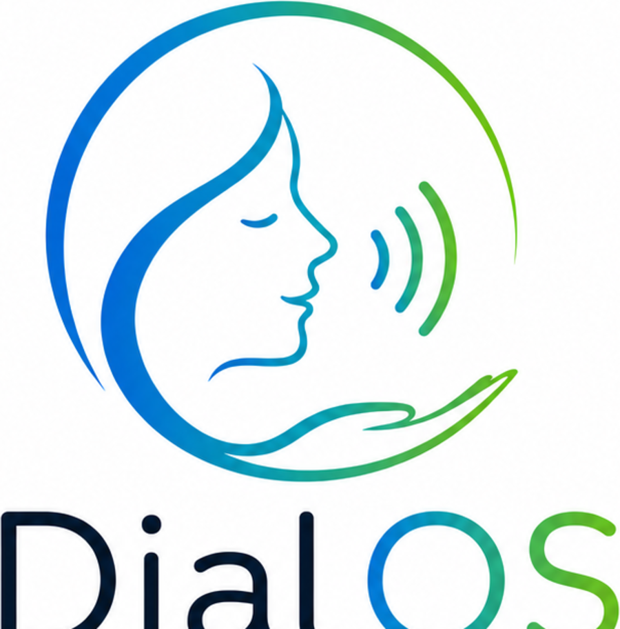

[Deutsch](README.md) | [English](README.en.md) | [Changelog](#changelog)



Website: [dialos.org](https://dialos.org)

# DialOS

A fully voice-controlled system based on Debian 13 + GNOME 48 for people who
can only use a computer to a limited extent — in particular blind and
motor-impaired individuals. The goal is a ready-to-use laptop that the
user can operate entirely by speaking: listening to radio and music,
writing letters, searching the web, using streaming media libraries
(ARD/ZDF Mediatheken), writing emails, making phone calls, video calls —
all the way to complete system maintenance.

The initial focus is on the German-speaking region (Germany, Austria,
Switzerland).

This project was created in collaboration with [Claude](https://claude.com).

## Status

**Since 2026-08-16, DialOS runs on real hardware.** Three commands turn a
bare Debian 13/GNOME install into the finished system – verified
end-to-end on the reference device (ThinkPad T490):

```bash
./scripts/dialos-full-office-setup.sh                    # packages, branding, speech output, Vosk
/usr/local/sbin/dialos-setup-home-partition.sh           # encrypted swap + nutzer partition
sudo ./scripts/dialos-buero-setup-abschliessen.sh dialosadmin   # account + autologin
```

**What works:** speech output via Piper, speech recognition via Vosk, the
complete security design (encrypted `nutzer` partition and encrypted
swap, the security stick as a presence token – proven in both directions:
without the stick the account is locked and the data sealed, with it
`nutzer` logs in automatically), autologin, branding, default
applications.

**What is still missing – the actual core:** voice control itself. Vosk
and hassil are installed and passed their first real test with the volume
prompt during the startup announcement, but continuous listening with a
wake word and a command grammar do not exist yet. Also open: telephony
and the WWAN variant.

Details on the respective state are in the [changelog](#changelog),
concrete next steps in [TODO.en.md](TODO.en.md).

## Documentation

- [Debian to DialOS](docs/Debian-zu-DialOS.en.md) – step-by-step recipe: from a bare Debian 13/GNOME install to the current version
- [Architecture overview](docs/architektur-uebersicht.en.md) – goal, target audience, core features, software stack
- [Hardware](docs/hardware.en.md) – reference device, test hardware, WWAN requirements
- [Security & privacy](docs/sicherheit-datenschutz.en.md) – autologin, encryption, remote support, shipping
- [Voice control](docs/sprachsteuerung.en.md) – STT/TTS stack, intent recognition, design principles
- [Telephony & video calls](docs/telefonie.en.md) – SIM and phone-tethering, fallback logic
- [Initial setup & rollout](docs/ersteinrichtung.en.md) – two-phase provisioning, voice assistant, privacy variants
- [Open questions](docs/offene-punkte.en.md) – what still needs to be decided
- [Image ledger](docs/iso-builds.en.md) – which backup image belongs to which code state (Rescuezilla/Clonezilla)

## Logo & branding

More variants are available in [assets/](assets/): `mark.png` (icon
alone), `logo-tagline.png` (with tagline), `logo-full.png` (with the
feature icon row), `logo-horizontal-light.png`/`-dark.png` (horizontal
version for light/dark backgrounds), `app-icon-light.png`/`-dark.png`
(square app icon), and `brand-sheet.png` as a complete reference
overview. Plus `wallpaper-light.png`/`wallpaper-dark.png` (desktop
background) and `splash.png` (boot/login screen).

## Test environment

- **Laptop:** Lenovo ThinkPad T490 (no WWAN module)
- **Audio:** AIRHUG 01 – Bluetooth headset, the reference device for
  voice control since 2026-08-16 (see [hardware.en.md](docs/hardware.en.md)).
  Falling back to the built-in speakers/microphone is mandatory and has
  been proven for the output side.
- **Input devices:** Logitech Pebble M350s (mouse), Pebble K380s (keyboard)
- **Security stick:** 64 GB, split into `DIALOS-KEY` (key file, ext4) and
  `DIALOS-DATA` (exFAT, also readable on Windows/macOS)
- **Android test device** for phone tethering (USB tethering + GSConnect)

## Changelog

### 0.5.0
- **Rule established: the fallback to the built-in devices must always be
  guaranteed (Stephan, 2026-08-16).** A switched-off, empty or
  disconnected headset must never leave DialOS mute or deaf - for a blind
  user that would be the total failure, because they would not notice the
  headset is off. Checking this revealed a **contradiction between docs
  and code**: `docs/offene-punkte.en.md` listed the fallback switchover as
  "not implemented", whereas `waehle_mikrofon_fuer_lautstaerke()` has long
  picked the first non-monitor source when no `bluez_input` is present -
  i.e. the built-in microphone. On the output side PipeWire moves the
  default sink by itself. The open item is therefore not missing logic but
  that **neither has ever been tested without Bluetooth**; the docs are
  corrected accordingly. **The output side was proven the same day:**
  headset switched off, announcement started - sound came from the
  built-in speaker. Only the input side remains open, i.e. whether the
  built-in microphone understands the volume question. Named as the harder, still-open case: a device
  that is *connected* but transmits nothing - no fallback triggers there,
  because from the outside everything looks fine.
- **Reference audio device settled: AIRHUG 01 (Stephan, 2026-08-16).**
  This decides the hardware question that was blocking voice control -
  tuning recognition thresholds and recording durations against a
  microphone that later changes would mean doing the work twice. Read off
  the device and recorded in `docs/hardware.en.md`: class `0x00240404`,
  profiles **A2DP** and **HFP**. The key point is that it cannot do both
  at once - A2DP has no microphone channel, HFP degrades playback
  quality. The profile switch in `dialos-start-ansage.py` is therefore
  not a quirk of the code but a property of the Bluetooth profiles, and
  will be needed with any comparable headset. Also documented: the input
  devices (Logitech Pebble M350s/K380s), whose battery level the startup
  announcement reads out to administrator accounts only.
- **Step 16: Penguins' Eggs dropped, Rescuezilla takes over (Stephan's
  decision, 2026-08-16).** The trigger was mundane: `eggs` was missing on
  the rebuilt device. It is not in Debian's repositories, was in no
  package list, and **how to install it was documented nowhere** -
  neither in the guide nor in the commit history. The same kind of gap as
  `check_piper_voice.sh`: done by hand once, never written down, lost in
  the reinstall. Since the ISO has not been an installation medium since
  path A but only a backup snapshot, the choice fell on
  [Rescuezilla](https://rescuezilla.com/) - the graphical front-end for
  Clonezilla, which is in Debian and needs no third-party repository.
  Stephan creates the images himself; the docs only record the three
  points that follow from the DialOS layout: Clonezilla does not run from
  the running system, the **LUKS partition must not go into the image**
  (Clonezilla cannot see inside it and would copy all ~375 GB byte by
  byte instead of the ~15 GB of used blocks), and `nutzer`'s data is
  therefore deliberately not included. All dead remnants were removed
  too: the `splash.png` for the eggs boot area including its step 3
  block, the `/etc/penguins-eggs.d` directory, and the sudoers rule in
  `dialos-claude-setup.sh` that granted passwordless `sudo` for a no
  longer existing `/usr/bin/eggs` - the script now removes it instead of
  creating it.
- **Pronunciation: "DialOS" is now spoken as "Dial OS" (Stephan's
  request, 2026-08-16).** Implemented **centrally** in `dialos-say.py`:
  every text passes through `fuer_sprachausgabe()` before being spoken.
  No future announcement can forget the split, and the texts stay
  correctly spelled in the source - the announcement text simply says
  "DialOS" again. The search incidentally showed there was only **one**
  occurrence in spoken text; all other hits were paths, comments and
  variable names that are never spoken. The rule leaves `dialosadmin` and
  `dialos.org` untouched - both covered by tests. It also turned out my
  comment about the rule was wrong (a hyphen *is* a word boundary, so
  `DialOS-System` does get split - correctly); the comment was fixed, not
  the code.
- **Without the stick, `nutzer` is now locked, not merely without
  autologin (2026-08-16, prompted by Stephan's question whether one can
  log in at all without the stick).** Autologin alone was incomplete as
  protection: without the stick GDM still lists both accounts, and anyone
  knowing `nutzer`'s random password - printed once when
  `dialos-setup-nutzer.sh` generates it - could still have logged in.
  `/home/nutzer` would **not** have been mounted, so the session would
  have run against a directory on the **unencrypted** root partition: at
  best failing on permissions, at worst creating a profile in the clear.
  `dialos-stick-gate.sh` now additionally locks the account
  (`usermod -L`) and unlocks it again as soon as the stick is present.
  The order is not arbitrary - unlock first, then set autologin, because
  AccountsService rejects `SetAutomaticLogin` for a locked account with
  "user is locked" (the same fault that already cost time on
  2026-08-11). `dialosadmin` is never locked.
  **Proven on real hardware the same day** - after a boot without the
  stick, five layers hold at once: stick physically absent, LUKS
  container closed (`nvme0n1p4` is `crypto_LUKS` with no mapper),
  `/home/nutzer` not a mountpoint, account at `L`, no `nutzer` session.
  The encrypted swap keeps running throughout - it uses a key
  re-randomized per boot and does not depend on the stick. Exactly the
  intended separation. **The return direction confirmed too:** stick
  plugged back in and rebooted - autologin works, the account is back at
  `P`, and the announcement comes at the remembered 25% **without asking
  about volume again**. That also proves the second half of the new volume
  logic: not just "asked and remembered", but "not asked again next
  time".
  **For clarity, since the question is natural:** the recovery passphrase
  is *not* a login password. It is the second LUKS key slot and only
  unlocks the partition manually (`cryptsetup open`) - for the "stick
  lost" emergency, together with `dialos-rekey`.
- **Volume prompt: ask once instead of at every login - and afterwards
  rather than before (Stephan's requirement, 2026-08-16).** Until now the
  question came at every login and **before** the announcement. Both were
  awkward: someone who hears "how loud should I be?" as the very first
  thing has no reference for how loud the system actually is - a
  meaningless yardstick for a blind user. Now `nutzer`'s first login
  speaks the normal announcement first, then asks, remembers the answer in
  `~/.config/dialos/lautstaerke` and confirms it **at the newly chosen
  volume** - so it is immediately audible what was settled on. Every later
  login uses the remembered value without asking; deleting the file resets
  it. Since `nutzer`'s home sits on the encrypted partition, the setting is
  as protected as the rest of their data. **Confirmed live the same
  day:** the announcement ran, the question followed it, and Stephan's
  spoken "25" was recognized and stored permanently.
  - **"off" is deliberately NOT stored permanently** and applies only to
    the current login. If it were permanent, no announcement would come -
    and therefore never this question again. A blind user would have no way
    back without outside help. A real permanent off switch needs a
    different route back via voice control first.
  - `frage_lautstaerke()` now returns `None` on any failure instead of
    `100`. Only that distinguishes "the user said 100" (remember) from "we
    understood nothing" (remember nothing, ask again next time) -
    previously a failed recognition attempt would have been written down
    permanently as a deliberate choice.
- **First reboot after the build: all four open checks passed
  (2026-08-16).** Evidenced by the journal: `systemd-cryptsetup@cryptswap`
  starts and finishes cleanly (so the encrypted swap comes up on its own -
  that was the last untested link), `dialos-stick-gate` finds the stick,
  mounts the home partition and enables autologin, and `nutzer` then logs
  in automatically. A design detail confirmed itself along the way: the
  security stick had moved from `/dev/sda` to `/dev/sdb` because the
  external drive was enumerated first - because `dialos-stick-gate.sh`
  looks it up by label via `blkid -L DIALOS-KEY` rather than by device
  path, that had no consequences.
- **Preseed provisioning reduced to a single command (2026-08-16).** The
  Debian installer fetches the file over **plain HTTP** - the Debian docs
  list only `http://` and `tftp://` for `preseed/url`. Both obvious
  hosting options failed on that in turn: dialos.org runs WordPress and
  forcibly redirects to HTTPS (the file is now correctly in place there,
  but only reachable via that redirect), and Nextcloud enforces HTTPS
  even more strictly while adding long token URLs that would have to be
  typed at the boot prompt. New script
  `scripts/dialos-preseed-server.sh`: checks file and port, determines
  the IP address, prints the ready-made `preseed/url` line and starts the
  server. Verified live - 200, zero redirects, byte-identical to the
  repo. **The decisive point came from Stephan:** the target device is
  being wiped and cannot serve the file itself - the external drive
  holding the repo gets plugged into any second computer during the
  installation. That gives the drive a second purpose beyond "survives
  the reinstall", now also recorded in the practical note. No nginx
  changes needed, WordPress stays untouched.
- **The startup announcement could hang indefinitely - muting audio
  forever in the process (found 2026-08-16 via Stephan's question about
  why the speech icon was permanently lit).** Of the four
  `subprocess.run` calls in `dialos-say.py`, the two `spd-say` calls of
  all things had **no timeout**; every other one uses `timeout=5`. While
  speech output was broken (missing `check_piper_voice.sh`), `spd-say
  --wait` waited for an end signal that never came - the process had been
  standing for **75 minutes** when inspected. The real damage is not the
  icon: because the script hangs, the `finally` block is **never**
  reached - and that block restores the sources muted for audio ducking.
  Had `nutzer` been listening to radio at login, it would have stayed
  permanently silent, for no visible reason and with no way for a blind
  user to recover. This time it only affected speech-dispatcher's own
  streams, which ducking excludes anyway - luck, not design. Fixed: both
  calls now go through a helper with a time limit (20 s for the warm-up,
  60 s plus a length-based allowance for the text, capped at 300 s -
  102 s for the real announcement against ~40 s of speech). Until then
  the docstring claimed the marker was "removed reliably, even on
  errors" - that held for exceptions, not for hangs.
- **The speaking marker was a fixed path in shared `/tmp`.** All accounts
  shared `/tmp/dialos-sprachausgabe-aktiv`. Observed live: `nutzer`'s
  announcement created the file, whereupon `dialosadmin`'s panel also
  showed the speech icon permanently although nothing was speaking there.
  Made worse by `/tmp`'s sticky bit - `dialosadmin` could neither
  overwrite nor delete the foreign file, and `markierung_setzen()` failed
  silently for lack of write permission. The marker now lives under
  `$XDG_RUNTIME_DIR` (`/run/user/<uid>`): private per account and gone
  automatically at logout. `dialos-say.py` and `dialos-tts-indicator.py`
  derive the path with identical logic.
- **The first reboot exposed three gaps - all of them visible only on
  real hardware (2026-08-16).**
  - **Speech output was completely silent, for two independent reasons.**
    `piper-generic.conf` starts its synthesis chain with
    `./check_piper_voice.sh $VOICE && …` - that file existed nowhere: not
    on the system, not in the repo, not in the docs. The `&&` chain broke
    immediately and **not a single audio sample was ever produced**. And
    with no error message at all: the panel icon still appeared, because
    `dialos-tts-indicator.py` runs independently of synthesis - so the
    fault looked like "running, but quiet". On the old test device the
    file must have existed as a hand-made leftover and was lost in the
    reinstall - exactly the gap `docs/Debian-zu-DialOS.en.md` is meant to
    close. Second, `pulseaudio-utils` was missing from the package list:
    no `paplay` (playback at the end of the piper chain), no `parec`
    (recording for the volume prompt), no `pactl` (audio ducking and the
    Bluetooth profile switch in `dialos-start-ansage.py`). On the old
    system the package happened to be present, which is why it never
    surfaced. **Both fixed and confirmed acoustically the same day** -
    measured link by link first (129,652 bytes of raw audio from piper, a
    41,140-byte WAV after sox at 22,050 Hz), then heard by Stephan via
    `spd-say`.
  - **The keyboard was set to Japanese (Mozc).** The cause is a
    contradiction within the guide itself: step 1 says "choose GNOME in
    the Debian installer" - and that very choice installs
    `task-gnome-desktop`, the package step 2 explicitly warns against.
    Its Recommends pulled in **138** foreign-language `task-*` packages
    along with `ibus-mozc`/`ibus-anthy`; both accounts had
    `[('ibus','mozc-jp'), ('xkb','de')]`, i.e. Mozc first. Two levels of
    fix: a new step 2b clears out the language packages
    (`task-gnome-desktop` itself stays, it holds the desktop together),
    and `01-dialos-defaults` now sets the German keyboard as the **only**
    input source - as a dconf default for every account, including
    future ones.
  - **The cleanup took `gnome-accessibility-themes` with it.**
    `apt-get autoremove --purge` removes everything nobody requests after
    the purge, and does not know the difference between a Thai font and a
    contrast theme - on a system for people with impaired vision of all
    things. Fixed on two levels: the package is now explicitly in the
    package list, and step 2b re-asserts the entire list after the
    `autoremove`. Everything in it is thereby marked "manually installed"
    again and protected against future `autoremove` - not just this one
    package.
- **Partitioning is no longer done by hand: a preseed for the Debian
  installer (2026-08-16).** Stephan wanted to stop thinking about disk
  size during the initial install. His first idea - use the whole disk
  and shrink it to 100 GiB afterwards with a script - is technically
  impossible: a **mounted** ext4 filesystem cannot be shrunk, online
  resize can only grow. No script on the running system can shrink the
  root partition; that would only work from a live session, at the cost
  of an extra reboot per device and the risk of destroying the system if
  the shrink is interrupted. Hence the reverse approach: the correct
  layout is created during installation. New:
  `website/d-i/trixie/preseed.cfg` gives the Debian
  installer EFI + exactly 100 GiB root and leaves the **entire rest
  unpartitioned** - independent of disk size, with no number to adjust
  anywhere. The target disk deliberately stays an interactive question:
  that is the only safeguard against the preset hitting the installation
  stick or an external drive. No swap in the recipe - step 12 creates an
  encrypted one. Doc step 1 is structured into 1a-1d for this: where to
  put the file on dialos.org, the exact key sequence in the boot menu
  (UEFI `e`, BIOS `Tab`), what happens afterwards, and the manual
  fallback. **Corrected the same day:** it first said a network cable was
  mandatory. That was wrong - the Debian docs are unambiguous that the
  network is configured *before* the preseed is fetched ("the network
  must be configured before the preseed file can be fetched"). WiFi works
  just as well: at the network step the installer asks for the WiFi name
  and password and only then downloads the file. The same check produced
  a second improvement: the widespread short command `auto url=…` is
  gone. Automated mode exists only to preseed language and keyboard too,
  but lowers the question priority in the process - which could have
  suppressed the WiFi prompts of all things. The address is now simply
  spelled out (`preseed/url=…`).
- **Path A decided (Stephan, 2026-08-16): Calamares and `dialos-install`
  removed entirely.** Every customer device is set up in the office -
  empty disk, the current Debian 13/GNOME ISO off debian.org, creating
  `dialosadmin` along the way, then the three DialOS scripts. Nobody but
  Stephan ever sees an installer, so both tools lose their purpose.
  Removed: the entire Calamares branding (`branding/dialos`,
  `locale.conf`, `shellprocess.conf`), the Penguins' Eggs vendor overlay,
  `base.yaml.tmpl`, `install-system.desktop` and `dialos-install` with its
  launcher. Doc step 5 is now "Remove Calamares" and cleans up devices
  that still have it - the step number stays so all cross-references
  remain valid. **`dialos-rekey` stays**: it replaces a lost or broken
  security stick and is therefore a maintenance tool, not an installer;
  its launcher takes the place of the former `dialos-install` one.
  `dialos-install`'s LUKS/stick logic lives on unchanged in
  `dialos-setup-home-partition.sh`, which was derived from it. The ISO
  (`eggs produce`) now serves only as a backup snapshot. This also
  disposes of the open item about Calamares' wrong GeoIP location
  suggestion.
- **`nutzer` would have got a home they don't own - found during the
  first real run of script 3 (2026-08-16).** `adduser` reported "The home
  directory `/home/nutzer' already exists. Not touching this directory"
  and consequently skipped **both** the `chown` to the new account *and*
  copying `/etc/skel`. The home was left owned by `root:root` - `nutzer`
  could not have written to their own directory, and GNOME could have
  created neither `~/.config` nor `~/.cache`. On an account that starts
  via autologin and whose user is blind, that would have been a total
  failure with no way to self-recover. The cause is the new build path
  itself: `dialos-setup-home-partition.sh` creates and mounts the
  encrypted partition *before* the account exists.
  `dialos-setup-nutzer.sh` now handles this afterwards (copy `/etc/skel`,
  `chown`, `chmod 700`) - copying only when the home is empty apart from
  `lost+found`, so existing data is never overwritten.
- **Noticed alongside it: the real system's `/etc/skel` was never
  populated.** Steps 9 and 10 previously copied the DialOS templates from
  the repo into `dialosadmin`'s home only. `nutzer` would therefore have
  received neither the Bluetooth battery extension, nor Thunderbird as
  the default mail client, nor the Nautilus bookmarks - even though the
  guide explicitly names `/etc/skel` as the route "automatically for new
  accounts". Both steps now additionally place the files there; admin
  scripts still explicitly do **not** belong in `/etc/skel` (the
  2026-08-14 correction stands unchanged).
- **First real end-to-end run on the T490 (2026-08-16) - scripts 1 and 2
  completed.** Every fault fixed beforehand would have occurred for real
  (the RustDesk dependency fallback visibly kicked in), and the fixes
  proved themselves in practice: the Vosk models are correctly unpacked
  for the first time (3.2 GB instead of the previously doubly-nested
  6.3 GB), user steps 9/10 landed in `/home/dialosadmin` rather than
  `/root`, the key backup is now owned by `dialosadmin` with mode `600`
  instead of `root` with `664` as in the 14 Aug run, and the ext4 label
  inside the LUKS container reads `dialos-nutzer` untruncated. Result:
  `dialos-nutzer-home` at 374.9 GiB, stick with `DIALOS-KEY` (2 GiB,
  ext4) + `DIALOS-DATA` (57.8 GiB, exFAT). Also confirmed: Claude Code
  2.1.233 runs on Debian's Node 20 despite the `EBADENGINE` warning - the
  doc's claim still holds.
- **Uncovered in the process: `systemd-cryptsetup` was missing from the
  package list.** Debian 13 split `/etc/crypttab` handling out of the
  `systemd` package. Without it, neither the generator nor
  `systemd-cryptsetup@.service` exists - so the encrypted-swap entry had
  **no effect whatsoever, with no error message**, and after the run there
  was simply no active swap at all. The home partition still worked
  because `dialos-stick-gate.sh` opens it itself via `cryptsetup open`,
  which is why the omission only surfaced for swap. Package added, and the
  script now checks for it *before* touching the partition table. Three
  further fixes to the same code: the new swap partition is cleaned with
  `wipefs -a` (it starts at the old one's offset, whose swap header and
  old UUID would otherwise remain), the fstab line gets `nofail` (a
  blocked boot would be worse on a device for blind users than a missing
  swap), and immediate activation goes directly through `cryptsetup open
  --type plain` instead of `systemctl start` on a unit that does not exist
  before the next boot.
- **Swap is now encrypted (8 GiB, key re-randomized every boot) - decided
  and implemented 2026-08-16.** Until then the T490 carried a 37.3 GiB
  plaintext swap partition. That allowed `nutzer`'s memory pages - open
  documents, mail, browser content - to land on disk in the clear,
  bypassing the LUKS protection of `dialos-nutzer-home`: readable without
  the security stick, and likewise after removing the SSD.
  `dialos-setup-home-partition.sh` now replaces any plaintext swap it
  finds with 8 GiB via `/etc/crypttab` using `/dev/urandom` as the key
  source, sets `vm.swappiness=10` and `RESUME=none`, and hands the freed
  space straight to the home partition (on the T490: 345.6 → about
  375 GiB).
  - The crypttab entry deliberately references the **PARTUUID**, not the
    filesystem UUID: the `swap` option creates a fresh filesystem on every
    boot, so that UUID keeps changing.
  - **8 GiB instead of "as much as RAM":** the `swap ≥ RAM` rule of thumb
    exists only for hibernation - which was already impossible under this
    stick-gate design, because the image would contain `nutzer`'s
    decrypted data and would have to be readable at boot before anything
    else (exactly the discarded `cryptsetup-initramfs` approach). The
    random key now rules hibernation out for good; suspend-to-RAM is
    unaffected.
  - **Dropping swap entirely** was not an option despite 46 GiB of RAM:
    without swap the OOM killer terminates processes outright under memory
    pressure, and a killed screen reader or speech output means a blind
    user loses all feedback. The 8 GiB are the cushion against that.
- **Timezone/locale decided:** the build and reference device stays on
  `Europe/Vienna` + `de_AT.UTF-8` instead of the `Europe/Berlin`
  documented until then. Consequence, now recorded in step 1: the two
  customer paths yield different timezones - Calamares still hard-sets
  Berlin from `locale.conf`, while `dialos-install` as a cloning tool
  copies the running system and thus passes Vienna on.
- **From Debian 13 to DialOS in three commands - script review before the
  first real run (2026-08-16).** `dialos-full-office-setup.sh` and
  `dialos-setup-home-partition.sh` had only been syntax-checked until
  then and never actually run. Reviewing them against
  `docs/Debian-zu-DialOS.en.md` on a freshly installed T490 turned up
  several faults that would have aborted the first run:
  - `python3-pip` was missing from the package list (`pip3` is not
    present on a fresh Debian 13) - step 15 would have failed at the very
    end of the run. Added together with `unzip`, which was also missing
    and only happened to be pre-installed.
  - Step 7 called `npm install -g` without `sudo` - Debian's npm prefix
    is `/usr/local`, so it fails with `EACCES` and would have taken steps
    8-15 down with it via `set -e`. Also corrected in the docs, where the
    command was likewise listed without `sudo`.
  - No guard against starting with `sudo`: steps 9 and 10 set up the user
    account and write to `~`, which under `sudo` would have been `/root` -
    silently, with no error. Starting as root is now refused; `sudo -v`
    asks for the password once up front instead of mid-download.
  - `systemctl disable --now rustdesk` without `|| true` would have
    aborted the rest of the run on a renamed/missing unit.
  - In `dialos-setup-home-partition.sh`, of the four dialog helpers it
    was precisely the password prompt that had **no** fallback: without a
    graphical environment (e.g. via `sudo` from a text console - `sudo`
    strips `DISPLAY` via `env_reset`) the script terminated silently at
    that point, because `VAR=$(zenity …)` aborts under `set -e`. Now
    falls back to terminal input, limited to three attempts. For the same
    reason the explanatory abort messages in the stick picker were dead
    code (`|| true` added).
  - The new partition was determined as "highest existing number". But
    parted assigns the lowest **free** number - with a gap in the
    numbering, an existing partition would have been overwritten by
    `luksFormat`. Now compares the numbers before/after and aborts if the
    result is ambiguous.
  - The key-backup save dialog started in `$HOME`, i.e. `/root` under
    `pkexec`/`sudo` instead of the admin account's Nextcloud folder, and
    the saved file was owned by `root`. The calling account's home is now
    resolved (`PKEXEC_UID`/`SUDO_UID`) and the file handed over to it.
  - The recovery passphrase was written to a fixed `/tmp/.rp` with the
    default umask, so it was briefly world-readable (now `mktemp`, 600).
  - The ext4 label `dialos-nutzer-home` is 18 characters, ext4 allows 16
    - `mkfs.ext4` silently truncated it to `dialos-nutzer-ho`. Harmless,
    since the LUKS2 label is what matters for finding the partition, but
    misleading in the log; now `dialos-nutzer`.
  - The stick picker now shows a "current content" column - a plugged-in
    installation stick was previously indistinguishable from an empty
    one, despite being wiped completely.
  - **Last manual work eliminated:** the desktop provisioning from doc
    step 13 (scripts, Claude desktop `.deb`, launcher for
    `dialos-install` including `gio set metadata::trusted`) wasn't in any
    script. It is now part of `dialos-buero-setup-abschliessen.sh`, which
    means the device build after the base install consists entirely of
    three script invocations.
  - **Doc reconciliation for step 1:** the T490's real partitioning
    (100.00 GB root, 954 MB ESP, 37.3 GiB swap, 345.6 GiB free) is now
    documented as a reference table. The swap partition was missing from
    the guide entirely - including the warning that it is unencrypted, so
    `nutzer`'s paged-out memory can end up in the clear on disk, bypassing
    the LUKS protection.
- **`dialos-install` bugfix:** the file-save dialog for the key backup
  silently failed under `pkexec` (missing `DBUS_SESSION_BUS_ADDRESS`/
  `XDG_RUNTIME_DIR` for reaching `xdg-desktop-portal`) - `pkexec` now
  passes through the needed environment variables, and real `zenity`
  errors are no longer swallowed. Also added: a clickable desktop icon
  for `dialos-install` on `dialosadmin`'s desktop.
- **Key-backup security fix:** `dialos-install` and `dialos-rekey` used
  to encrypt the Nextcloud backup of the LUKS key file with the same
  recovery passphrase that also serves as the second LUKS key slot -
  anyone who knew both could have decrypted the key entirely without the
  physical stick. Now: a dedicated, randomly generated backup password
  (`openssl rand -base64 32`), the password is passed to `openssl` via a
  shredded temp file instead of a command-line argument (prevents
  visibility in `ps aux`), and the recovery passphrase now requires at
  least 12 characters.
- **Security stick now partitioned into two areas:** `DIALOS-KEY` (2
  GiB, FAT32, as before for the key file) + `DIALOS-DATA` (remaining
  capacity, ext4, general-purpose storage) - previously the stick's
  entire capacity was "wasted" on the tiny key file. A new minimum-size
  check (~2.5 GB) prevents a broken/empty data partition on sticks that
  are too small. Also fixed a bug: the security-stick picker in
  `dialos-install` (unlike the target-disk picker) didn't exclude the
  current live boot medium - with three media plugged in (boot stick,
  security stick, internal disk), the boot stick could have been
  mistakenly selectable as the security stick.
- **Admin access documented, then corrected:** GNOME "switch user" was
  first documented as a way to get parallel `dialosadmin` access
  alongside the running `nutzer` session. While reconstructing the
  previous day's session, an already-discovered bug came to light (see
  below): "switch user" leaves `nutzer`'s session active in the
  background, and two concurrently running `dialos-start-ansage.py`
  instances then compete over Bluetooth/audio. Corrected practice:
  properly log `nutzer` off, then log in as `dialosadmin`. A boot-time
  key combination for direct admin access remains noted as an open
  improvement option (`docs/offene-punkte.md`).
- **Bluetooth audio bug fixed** (`dialos-start-ansage.py`): after login,
  the voice announcement over the Bluetooth speaker intermittently
  stayed silent. Cause: multiple concurrently running script instances
  (from switching accounts without a proper logout) competed over
  Bluetooth reconnect and audio muting. Fix: a per-account
  single-instance lock (`alte_instanz_beenden()`) plus a Bluetooth debug
  log (`bluetooth_debug_snapshot()`) for future troubleshooting without
  manual reproduction.
- **Speech recognition (Vosk) brought up technically:** Vosk 0.3.45 +
  German models (large `vosk-model-de-0.21`, 6.3 GB; small
  `vosk-model-small-de-0.15`, 183 MB) installed, a pure technical test
  script `dialos-vosk-test.py` (choose microphone, record, transcribe,
  display in the terminal - not yet wired to intent recognition/TTS).
  Recording mode deliberately "record fully first, then recognize"
  rather than real-time streaming, since the large model is described
  officially as intended for telephony/servers, not real-time use on
  laptop hardware. Microphone comparison test, AIRHUG Bluetooth vs.
  built-in laptop microphone: Bluetooth clearly superior (6 out of 8
  test sentences exactly correct at normal speaking volume, vs.
  noticeably weaker results with the built-in microphone) - target
  design: DialOS will always be installed with a mobile Bluetooth
  speaker/microphone, with the built-in microphone only as a (not yet
  implemented) fallback.
- **Intent recognition set to [hassil](https://github.com/OHF-Voice/hassil)**
  instead of the originally planned Rhasspy, which was archived by its
  creator in 2026 and is no longer maintained - hassil offers the same
  example-sentence approach, but as a lightweight Python library with no
  Docker/dedicated service (see
  [docs/sprachsteuerung.en.md](docs/sprachsteuerung.en.md)).
- New voice-output-active indicator in the GNOME panel
  (`dialos-tts-indicator.py`): an icon appears during every voice
  announcement and reliably disappears afterward - useful if the volume
  is set too low and a sighted person should still be able to see that
  something is being/was spoken.
- `dialos-start-ansage.py` further improved: fixed a German number-word
  bug, folded the internet-status/weather/closing remarks into a single
  voice-output call instead of several (this had caused brief flashes of
  background music between calls), battery announcements now only for
  devices that are actually connected, a new background monitor reports
  internet status changes after login too, account-based filtering
  (the customer account `nutzer` is only asked about laptop + speaker,
  every other account gets the full variant including mouse/keyboard).
- Network priority WLAN/wired over SIM implemented and verified on the
  T490 (NetworkManager route metrics).
- Built two test ISOs: `DialOS-Live-0.5.0.iso` (without cloning, a
  generic live user as a safety net) and `DialOS-Live-0.5.0-clone.iso`
  (with `--clone`, carries over `dialosadmin` and `nutzer` including
  home directories from the real system - intended for the planned live
  test of `dialos-install` with the security stick).
- Recovered two never-pushed commits from a stale local repo copy and
  brought them into the real repository (the Bluetooth fix and its
  documentation) - the repository now lives entirely on the external
  drive; the stale second copy had kept running unused in the meantime.
- **New `dialos-stick-gate` mechanism:** the planned live test of
  `dialos-install` with the security stick failed on 2026-08-14 - the
  reason wasn't a single bug but that the whole LUKS/initramfs path is
  structurally error-prone (the key file has to be available at exactly
  the right moment inside the initramfs, with almost no debugging
  options on site when something fails there). As a more robust addition
  (not a replacement - see TODO.md) there is now a purely software-based
  presence check: `dialos-stick-gate.service` checks on every boot via
  `blkid` whether the security stick (label `DIALOS-KEY`) is found, and
  switches `nutzer`'s autologin via AccountsService/`gdbus` accordingly -
  stick present: autologin on; stick missing: autologin off, GDM shows
  the normal login screen (practically only `dialosadmin` usable). Runs
  entirely in the normal system environment instead of the initramfs, so
  it avoids that path's pitfalls. Originally designed as a pure login
  filter (didn't yet protect the data itself) - **evolved further the
  same day, see next entry.**
- **Home-partition encryption replaces whole-disk LUKS:** instead of
  encrypting the entire target disk (the original approach that failed
  in the initramfs), `dialos-install` now only encrypts a dedicated
  `dialos-nutzer-home` partition (LUKS2, exclusively `/home/nutzer`) -
  root (~100 GiB, ext4) stays unencrypted and always boots normally.
  `dialos-stick-gate.service` opens the home partition after boot (no
  longer in the initramfs) and only then unlocks `nutzer`'s autologin -
  so it now actually protects `nutzer`'s data, not just login access
  like the first version above. `dialos-rekey` and
  `scripts/dialos-setup-nutzer.sh` (mount check before `adduser`)
  updated accordingly, dead `dialos-keyscript` initramfs code removed.
  Additionally: the security stick is now deliberately formatted
  **differently** per partition - `DIALOS-KEY` (the key) as **ext4**
  instead of FAT32, so the key file isn't even readable under Windows
  in the first place (and thanks to Unix permissions `root:root 755`,
  accessible only to root even under Linux); `DIALOS-DATA` (general
  storage) as **exFAT** instead of ext4, so `nutzer` can use it as an
  ordinary portable drive under Windows/macOS/Linux - recommended
  standard size 64 GB (≈62 GB usable `DIALOS-DATA`). The stick
  partitioning was manually verified against a real 59.8 GB USB stick
  (labels, filesystems, permission behavior all as expected); the full
  `dialos-install` installation on real hardware is still pending per
  TODO.md. Details:
  [docs/sicherheit-datenschutz.en.md](docs/sicherheit-datenschutz.en.md),
  section "Encrypting nutzer's data + security stick".
- **Vosk/hassil speech recognition documented as a repeatable recipe:**
  previously only installed live on the T490 by hand (TODO.md) -
  re-checking confirmed that this installation had actually been lost
  in the meantime (`import vosk` failed), due to a device reinstall.
  `docs/Debian-zu-DialOS.md` (step 15) now has the full recipe:
  system-wide install via
  `pip3 install --break-system-packages vosk==0.3.45 hassil==3.11.0`
  (Debian 13 otherwise blocks `pip install` into system Python via PEP
  668), download + correctly unpacking the German models (large +
  small). Found and avoided an unzip mistake from the original test run
  in the new docs: the model ZIPs already contain a named folder -
  `unzip -d <target>` therefore creates a doubly-nested structure under
  which `vosk.Model()` finds nothing (only worked on the T490 by
  accident, because `unzip` also copies files flat on a name collision
  - but wastes disk space, measured ~6.3 GB instead of ~3.2 GB for the
  large model). `dialos-vosk-test.py` (interactive technical test
  script) is now in the repo too. A real recognition test (actually
  speaking into it) is still pending per TODO.md.
- **Consolidation script + standalone home-partition setup:** Stephan
  wanted a continuous step-by-step guide from downloading the Debian
  installer to a finished DialOS - that surfaced a real gap: the
  `dialos-nutzer-home` partition + security stick could so far only be
  set up via `dialos-install`, which also wipes the entire target disk
  and copies the system onto it via rsync - wrong for a normal Debian
  installer build. New: `scripts/dialos-full-office-setup.sh` runs
  steps 2-12 + 15 from `Debian-zu-DialOS.md` automatically (one
  function per doc step, also callable individually; step 14,
  Bluetooth pairing data, is included as a function but only runs with
  `--bluetooth-kopplung`, since it's device-specific);
  `dialos-setup-home-partition.sh` reuses `dialos-install`'s LUKS/stick
  logic unchanged, but without the disk wipe - instead using free space
  at the end of the system disk. This requires deliberately leaving
  space free after the 100 GB root partition during the base install
  (step 1) - now documented in `Debian-zu-DialOS.md`. Both new scripts
  are only syntax-checked so far, not yet tested for real - planned for
  the next full T490 rebuild (see TODO.md).
- **Switched the weather location to GeoClue2:** triggered by a concrete
  live finding - `dialos-start-ansage.py` previously queried `wttr.in`
  without a location, which guesses the location itself via IP; on
  Stephan's network that showed Vienna instead of his real location
  (Seefeld in Tirol). A location fixed in the script was ruled out as a
  fix since the device is also meant to be used while traveling. Now
  `dialos-start-ansage.py` queries the location via GeoClue2 (system
  bus, automatically uses the best available source - WiFi lookup via
  Mozilla Location Service, otherwise an IP estimate as fallback) and
  passes the coordinates directly to `wttr.in`. Tested live at the real
  location along the way and found an important effect: GeoClue2 also
  falls back to a coarse IP estimate ("ipf fallback", ~25-26 km
  inaccurate, ~300 km off in reality) without a WiFi match in Mozilla's
  database - so a new accuracy threshold was added (fixes less accurate
  than 10 km are discarded), and the weather announcement is then
  deliberately skipped rather than naming the wrong city/region (same
  as with missing internet or missing Bluetooth devices - better to say
  nothing than something wrong). Deliberate trade-off: in areas with
  sparse WiFi-database coverage (e.g. rural regions), the weather
  announcement may therefore be missing more often than before.
  Prerequisite: unlock the app in `/etc/geoclue/geoclue.conf` +
  `org.gnome.system.location enabled=true` (now in
  `01-dialos-defaults`), otherwise `AccessDenied` - both found live and
  carried into `scripts/dialos-full-office-setup.sh`/
  `Debian-zu-DialOS.en.md`. Along the way: the weather announcement now
  also names the detected location ("Das Wetter in Seefeld in Tirol
  wird heute so sein.").
- **Volume prompt during the startup announcement:** a new request from
  Stephan - `dialos-start-ansage.py` now asks `nutzer` at the start of
  the announcement, by voice, "Wie laut soll ich sein? Sage 100, 75,
  50, 25 oder aus." (How loud should I be? Say 100, 75, 50, 25 or off),
  records for 4 seconds (Bluetooth microphone preferred, with the same
  `headset-head-unit` profile switch as in `dialos-vosk-test.py`) and
  recognizes the answer with the small German Vosk model - the **first
  real production use of Vosk** (previously only the technical test
  script). The result drives speech-dispatcher's own volume (`spd-say
  -i`, new `--lautstaerke` parameter in `dialos-say.py`) for the rest
  of the announcement; on "off", only the question itself is spoken,
  the rest is skipped entirely. Only for `nutzer` - `dialosadmin` & co.
  are never asked. On any failure (nothing understood, Vosk missing, no
  microphone), the function falls back to 100% so the announcement
  never gets skipped or hangs because of this extra question. The
  recognition/mapping logic was verified by having Piper synthetically
  speak all five options and confirming Vosk recognized them correctly.
  **Update 2026-08-16, real test with Stephan's voice:** found and
  fixed a real bug along the way - the first attempt lacked a clear
  signal for exactly when the 4-second recording window starts,
  Stephan's spoken answer ("25") was missed, only the 100% safety
  fallback came through. Fix: right before recording, the function now
  additionally says "Und jetzt bitte." (And now, please.) - correctly
  recognized on the second attempt afterward (a real spoken "25" → 25%,
  via the Bluetooth microphone including the profile switch).

### 0.4.0
- Removed Evolution and GNOME Calendar from the app grid and search
  (only Thunderbird should be used for email and calendar): `apt purge`
  isn't possible for either, since `evolution-data-server` and
  `gnome-calendar` respectively are tightly coupled to the
  `gnome`/`gnome-core`/`task-gnome-desktop` metapackages (an attempted
  removal would have pulled almost the entire GNOME desktop along with
  it - simulated beforehand via `apt-get -s purge` and aborted in time).
  Instead, override files with `NoDisplay=true` were created under
  `/usr/local/share/applications/org.gnome.Evolution.desktop` and
  `.../org.gnome.Calendar.desktop` - `/usr/local` is never touched by
  `apt`/`dpkg`, so the change survives future Debian updates.
- Set Thunderbird as the actual default for email links (`mailto:`) and
  calendar entries (`text/calendar`) (`xdg-mime`), including the German
  language pack (`thunderbird-l10n-de`, which - unlike Firefox and
  LibreOffice - isn't installed automatically via
  `task-german-desktop`). Both stored via
  `/etc/skel/.config/mimeapps.list` and the ISO package list
  (`desktop.list.chroot`) for every future account (DialOS-Admin as
  well as nutzer).
- Calamares now automatically removes itself after installation from
  the freshly installed target system (a new step in the
  `shellprocess` post-install module) - no longer needed on the target
  system. Important detail: the step runs exclusively inside the chroot
  of the NEW system, not on the live template that future ISOs are
  built from - otherwise the next ISO would ship without an installer
  at all. Not yet verified via a real installation.
- Baked the Bluetooth pairing data for this test device's three
  standard peripherals (mouse "Pebble M350s", keyboard "Pebble K380s",
  external speaker/microphone "AIRHUG 01") directly into the image
  (`/var/lib/bluetooth/<adapter-MAC>/...`), so that no re-pairing is
  needed after a reinstall on this laptop (works because the laptop's
  built-in Bluetooth adapter stays the same). While doing so, found and
  fixed an unanchored `.gitignore` rule (`cache/`) that would have
  accidentally filtered out real system directories like
  `var/cache/...` in the ISO template too.
- Set up a battery-level display in the top bar: the GNOME extension
  "Bluetooth Battery Monitor" shows laptop and Bluetooth device battery
  levels (reads the values via `upower`/UPower), battery percentage
  display enabled. Extension and setting stored system-wide as the
  default for all future accounts
  (`/etc/skel/.local/share/gnome-shell/extensions/`,
  `/etc/dconf/db/local.d/01-dialos-defaults`).
- New voice announcement at login ("Michael", the personal assistant,
  `/usr/local/bin/dialos-start-ansage.py`): greets the user, states the
  date and time, reads out the battery levels of laptop, mouse,
  keyboard, and speaker, reports the day's weather if there's an
  internet connection (morning/midday/afternoon/evening, including an
  umbrella hint if rain is likely, location auto-detected via IP), and
  says goodbye. Automatically reconnects all paired Bluetooth devices
  while doing so (fixes an issue where the Bluetooth speaker didn't
  reconnect on its own after a logout/login) and mutes other audio
  sources for the duration of the announcement via a reusable
  voice-output script with audio ducking (`/usr/local/bin/dialos-say.py`).
  Runs automatically at every login for all accounts
  (`/etc/xdg/autostart/dialos-start-ansage.desktop`).
- Sorted the changelog in this file into the correct (newest first)
  order.

### 0.3.0
- Set the login avatar for "DialOS-Admin": actually ran the office-setup
  script that already existed (`scripts/dialos-set-avatar.sh`, sets the
  DialOS mark as the profile picture via AccountsService/D-Bus) - it had
  previously only been written, never applied.
- Fixed and verified the autologin chain: created the standard user
  "nutzer", autologin now correctly runs via AccountsService (not via
  the ignored `/etc/gdm3/custom.conf`), the admin account keeps no
  autologin. Found and fixed a timing bug in
  `scripts/dialos-setup-nutzer.sh` along the way ("user is locked" right
  after `chpasswd`, because AccountsService hadn't yet noticed the new
  password entry) with retry logic (also backported into the ISO
  template under
  `iso-build/config/includes.chroot/etc/skel/Desktop/`).
- New fixed collection folder `~/Dokumente/DialOS/` on the test device
  for all files needed for setup after an installation - the first tool
  placed there is `nutzer-anlegen.sh` (a more robust copy of the
  autologin script) plus a form for Thunderbird account setup details
  (`thunderbird-angaben-formular.md`).
- Firefox: set the homepage to `https://dialos.org` via an enterprise
  policy (`policies.json` under `usr/lib/firefox-esr/distribution/` in
  the ISO recipe - the alternative `/etc/firefox-esr/` path isn't
  supported by this Debian package).
- Deferred an attempt to set a DialOS wallpaper as the background of the
  Firefox "New Tab" page: current Firefox versions no longer reliably
  respect `browser.newtab.url` (it just results in a blank page), and a
  custom extension for this would have required signing overhead, so it
  was deliberately not implemented.

### 0.2.0
- Ran and iteratively evaluated the first live-boot install tests on
  real hardware (Lenovo T490); set up the ISO build workflow with
  Penguins' Eggs (recipe under `iso-build/config/`, build and test cycle
  documented in CLAUDE.md).
- Worked out cosmetic fixes for the installer and confirmed them via a
  live-boot test: added an NTP client (`systemd-timesyncd`), enlarged
  the partitioning window (800×580 → 1000×700), the Calamares assistant
  now consistently shows DialOS branding instead of the Penguins' Eggs
  default look (vendor overlay under
  `/etc/penguins-eggs.d/brain.d/assets/calamares/`), the live installer
  icon in the app grid is now called "Install DialOS" with its own icon
  instead of "Install System" with the egg icon, and no more penguin
  promotional material shows during installation.
- Adjusted the live dash favorites: the generic "Install Debian" icon is
  now replaced there by the DialOS icon.
- Key insight along the way: `iso-build/config/includes.chroot/...` is
  only a template in the git repo - changes must be manually copied onto
  the real system before every `eggs produce`, otherwise they don't end
  up in the built image (details in CLAUDE.md).
- Known, deliberately deferred limitation: the location page in the
  installer sometimes suggests a wrong location based on GeoIP (e.g.
  Rome instead of Berlin) - no vendor override found for this;
  uncritical given two-phase provisioning.
- The git repository and ISO output folder now live on an external hard
  drive instead of only locally on the T490, so they survive a
  reinstall of the test machine.

### 0.1.0
- Project started: requirements, architecture, and design decisions from
  the concept phase documented.
